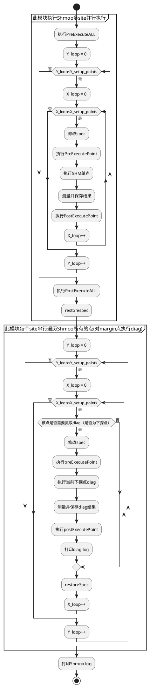
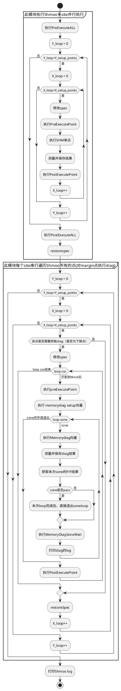

# VMM、SHM的Diag&MemoryDiag执行流程
## VMM_Diag执行流程如下

```plantuml
@startuml
start
partition 此模块执行VMM多site并行执行 {
:执行PreExecuteALL;

partition 粗扫VMM {
    :loop_rough=0;
    while (loop_rough<loop_rough_points) is (是)
        :修改spec;
        :执行PreExecutePoint;
        :执行VMM单点;
        :测量结果并保存;
        :执行PostExecutePoint;
    :loop_rough++;
    endwhile (否)

}



if(hasMargin_min) then (是)
partition 细扫Min {
    :loop_detail_min=0;
        while (loop_detail_min<loop_detail_points) is (是)
            :修改spec;
            :执行PreExecutePoint;
            :执行VMM单点;
            :测量结果并保存;
            :执行PostExecutePoint;
        :loop_detail_min++;
        endwhile (否) 
}
else (否)    
endif



if(hasMargin_mix) then (是)
partition 细扫Max {
    :loop_detail_max=0;
        while (loop_detail_max<loop_detail_points) is (是)
            :修改spec;
            :执行PreExecutePoint;
            :执行VMM单点;
            :测量结果并保存;
            :执行PostExecutePoint;
        :loop_detail_max++;
        endwhile (否) 
}
else (否)
endif

:执行PostExecuteALL;
:restorespec;
}

:打印VMMlog;


partition 此模块所有site串行执行先下探min再下探max(没有margin则不下探) {
:diag_loop = 0;

    while (diag_loop < diag_dip_points) is (是)
        :获取当前下探点的specValue;
        if(specValue是否超出了VMM的limit(start-end范围)) then (否)
        else (是)
        :specValue = limit;
        :diag_loop = diag_dip_points;
        endif
        :修改spec;
        :执行preExecutePoint;
        :执行当前下探点diag;
        :测量并保存diag结果;
        :执行postExecutePoint;
        :打印diag的log;
        :diag_loop++;
    endwhile (否)
:restoreSpec;
}

stop
@enduml
```



## VMM_MemoryDiag执行流程如下
```plantuml
start
partition 此模块执行VMM多site并行执行 {
:执行PreExecuteALL;
partition 粗扫VMM {
    :loop_rough=0;
    while (loop_rough<loop_rough_points) is (是)
        :修改spec;
        :执行PreExecutePoint;
        :执行VMM单点;
        :测量结果并保存;
        :执行PostExecutePoint;
    :loop_rough++;
    endwhile (否)

}


if(hasMargin_min) then (是)
partition 细扫Min {
    :loop_detail_min=0;
        while (loop_detail_min<loop_detail_points) is (是)
            :修改spec;
            :执行PreExecutePoint;
            :执行VMM单点;
            :测量结果并保存;
            :执行PostExecutePoint;
        :loop_detail_min++;
        endwhile (否) 
}
else (否)    
endif


if(hasMargin_mix) then (是)
partition 细扫Max {
    :loop_detail_max=0;
        while (loop_detail_max<loop_detail_points) is (是)
            :修改spec;
            :执行PreExecutePoint;
            :执行VMM单点;
            :测量结果并保存;
            :执行PostExecutePoint;
        :loop_detail_max++;
        endwhile (否) 
}
else (否)
endif

:执行PostExecuteALL;
:restorespec;
}

:打印VMMlog;

partition 此模块所有site串行执行先下探min再下探max(没有margin则不下探) {
:diag_loop = 0;

    while (diag_loop < diag_dip_points) is (是)
        :获取当前下探点的specValue;
        if(specValue是否超出了VMM的limit(start-end范围)) then (否)

        else (是)
        :specValue = limit;
        :diag_loop = diag_dip_points;
        endif
        :修改spec;
        :loop_csv = 1;
            while (loop_csv <= csv_max_line_number) is (是)
                if(blockNeme == CSV_line_blockName) then (是)
                    :执行preExecutePoint;
                    :执行 memorydiag setup向量;
                    :sone_loop_index = 1;
                        while (sone_loop <= mSONE) is (是)
                        :执行Memorydiag向量;
                        :测量并保存diag结果;
                        :获取本次sone的P/F结果;

                        if(本次sone是否pass)then(是)
                        :sone_loop = mSONE;
                        else (否)
                        endif
                        :执行MemoryDiagSoneWait;
                        :打印diag的log;
                        :sone_loop++;
                        end while (否)
                    :执行PostExecutePoint;
                    :loop_csv++;
                else(否)
                endif
            end while (否)

    :diag_loop++;
    endwhile (否)
:restoreSpec;

}

stop
@enduml
```
vminVmax模块hardfail时下探点值为PrimaryValue执行流程和上述流程图一样

## SHM_Diag执行流程如下




## SHM_MemoryDiag执行流程如下




