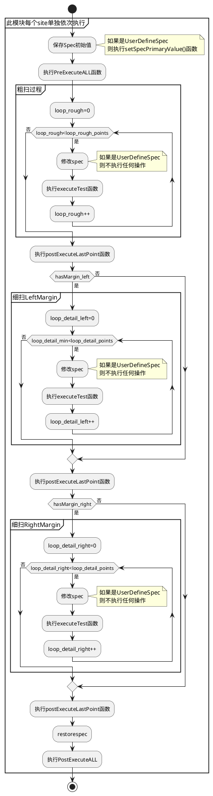
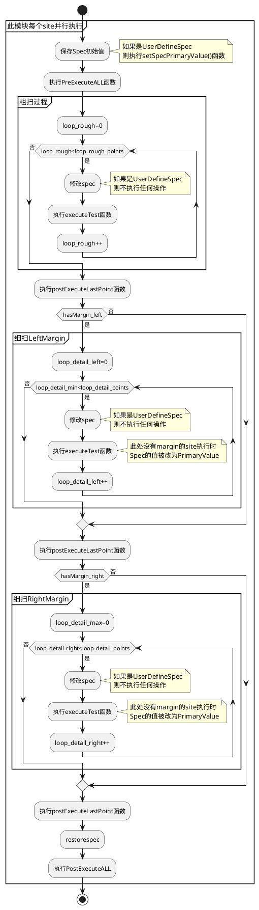

# SpecSearch接口功能

## 功能简介

随着各个项目对char需求不断增加，HiDigitalLink的VMM、FMM功能也需要得到一些扩展，不仅要支持FunctionalTest，还需要支持对用户自定义的TestMethod扫VMM或FMM等，所以我们开发了SpecSearch接口功能。用户需要继承相应的类，并重写相应函数即可对自定义代码进行Search操作，同时我们还提供了各个API方便用户完成预处理、结果设置等功能。

## 细扫算法说明
HDL对于VminVmax、FminFmax、SramRetention测试，粗扫完成后会基于粗扫结果Margin点向pass区域多扫0.2个粗扫step，向fail区域多扫1.2个粗扫step，以更合理的抓取pass和fail的临界点。实际项目中粗扫的Margin点为第二个点或倒数第二个点时，向fail的区域扫1.2个粗扫step时扫描点的值会超过用户设置的start或end的值，因此我们优化了这部分的算法，如果超过用户设置的边界值时让其等于边界值。

## 使用方法

SpecSearch接口的所有代码都放置在hicbb_comm_tml下的SpecSearch文件夹中，此文件夹中有两个demo示例，供用户参照使用。

其中Demo_SpecSearch_ParallelExec.cpp中展示的是用户需要所有site并行执行SpecSearch的示例，Demo_SpecSearch_SerialExec.cpp中展示的是每个site需要串行执行的示例

和TestMethod的创建方法类似

用户可以在initialize函数中调用addParameter函数来设计suiteUI参数

用户可以在executeTest函数中写自己的测试代码

**REGISTER_TESTMETHOD**

最后在完成TestMethod之后不要忘记使用REGISTER_TESTMETHOD，TDC: 116434

## executeTest()中可以使用的函数说明

用户在executeTest函数中写自己的测试代码，除了可以使用TestMtehod的API之外我们还提供了以下API方便用户设置或获取信息，供execute函数所使用的API如下：

| API列表 | API简介 |
| -------- | ------- |
|setResult()|返回为空，用于设置测试的pass和fail结果，必须在execute函数中使用，参数1为passfail的result，参数2为siteID，不指定siteID时，默认用的是当前execute函数正在执行的CurrentSite|
| getCurrentPointValue()|返回double类型，用于获取当前site当前search点的值，并行执行细扫时，每个site的值可能不同，因此需要放到FOR_EACH_SITE_BEGIN() - FOR_EACH_SITE_END() block中单独获取各个site的值
| getAllSiteCurrentPointValue()|返回值类型map<int,double>，用于在并行执行时获取所有site的当前point的值，map中key=siteID，value=site当前值，只能用于并行执行当中
|getSpecName()|返回值为string，用于获取用户在UI界面配置的SpecName|
|getPrimaryValue()|返回值double，用户获取Spec的PrimaryValue[^1]|
|reconnect()|返回为空，参数为Disconnect操作和connect操作之间的等待时间，用于对device进行disconnect并等待之后再connect|
|runLabelExecute()|返回为空，用于执行向量，参数1为向量名称，参数2和参数3分别为level和timing信息，可以不填，不填时使用测试项primary的level和timing，使用示例: runLabelExecute("AUTH_R02_HI3670V100_x1_S_52ns_V1","4,1,1","99,1,1")  runLabelExecute("AUTH_R02_HI3670V100_x1_S_52ns_V1","4,1,1","CHAIN_X1_M_10ns_P16_cb_Spec")|

execute函数中不能使用ON_FIRST_INVOCATION block的原因：在执行时在changeSpec之前和计算细扫margin之前无法确定对所有site统一操作还是对单个site单独操作，因此，在Serial_SpecSearch类中默认每个site单独执行，在Parallel_SpecSearch类中默认所有site并行执行。

## TestsuiteUI参数说明

SearchType: 可选MostSearch或BoundarySearch [^2]

SearchMode: 可选Relative或Absolute [^3]

RunDetailSearch: 可选Yes或No，选Yes时执行细扫，选No时不执行

SpecName: 用户填写需要扫描的Spec名称

SpecType: 用户可选Spec为LevelSpec还是TimingSpec(TimingSpec只能串行Search)，也可选UserDefinedSpec

End(UL): 用户填写需要search的终止点

Start(LL): 用户填写需要search的起始点

Points: 用户填写粗扫点的数量

Detail_points: 用户填写细扫点的数量

Output: 用户选择File、ReportUI、File+ReportUI、None

LogFile: 文件存储到file时，需要设置file路径和名称

## 执行逻辑说明

**串行执行说明**

如果是串行执行，所有site先执行粗扫，如果有marign点再执行细扫，site之间独立执行和打印结果，串行执行流程如下：

**并行执行说明**

如果是并行执行，所有site并行执行粗扫，只要有一个site有marign点则所有site都会执行细扫，此时对于没有margin点的site需要基于spec的primaryValue进行执行(和VMM执行逻辑一样)，最后对于粗扫没有margin的site只打印粗扫结果，对于粗扫有margin的site粗扫和细扫的结果都会打印

## PrePostExecute扩展功能说明
为了更灵活的满足测试需求，我们分别在整体代码执行前后以及粗扫细扫之后预留了接口可以供用户执行必要的操作

这三个函数的执行位置，由面流程图中可知，整体执行之前会执行preExecuteAll()函数，整体执行之后会执行postExecuteAll()函数，粗扫或者细扫完成之后都会执行postExecuteLastPoint()函数

这三个函数中也可调用以下两个函数，以协助完成相应操作：

| 函数名称 | 函数简介 |
| -------- | ------- |
|reconnect()|返回为空，参数为Disconnect操作和connect操作之间的等待时间，用于对device进行disconnect并等待之后再connect|
|runLabelExecute()|返回为空，用于执行向量，参数1为向量名称，参数2和参数3分别为level和timing信息，可以不填，不填时使用测试项primary的level和timing|

## UserDefinedSpec使用说明

通常我们对testMethod做char会修改levelSpec或timingSpec，但是特殊情况下用户可能想要利用HiDigitalLink的算法获取每个spec的值并自行操作，因此SpecSearch代码支持UserDefinedSpec功能

当UI参数SpecType选为UserDefinedSpec时，在上面流程图中修改Spec时不进行任何操作，需要用户在executeTest函数中调用getCurrentPointValue函数或者getAllSiteCurrentPointValue以获取site的当前pointValue并进行使用

使用UserDefinedSpec用户必须在用户自定义的TestMethod中重写setSpecPrimaryValue(double& value)函数，如果不重写默认的PrimaryValue值会被设置为0.1

## 重写judgeAndLog
judgeAndLog函数没有在上面流程图里面，此函数是PerSite执行，在代码中负责将当前site最终search到的spec的最大值和最小值打印到stdf和EDF数据中，此函数源码如下：

如果用户需要对当前site的min值和max值进行使用或其他处理，可以重写judgeAndLog函数，judgeAndLog函数形参currentSiteMinValue和currentSiteMaxValue分别为当前site扫描后的最终结果min值和max值，用户重写时可以使用这两个形参

## 注意事项

对于TimingSpec，Smartest不支持给不同的site同时改不同的值(如果这样操作会报错)，所以如果用户要Search TimingSpec，则必须串行执行。

[^1]:**PrimaryValue:** 指的是当前测试项spec的初始值。
[^2]:**SearchType MostSearch和BoundarySearch的区别:**
选择 MostSearch 时 spec值由Start开始到终止点End结束，记录 粗扫 pass 区间最长 的电压范围 ，若有相同长的pass区间取最右边的pass区间，程序将在该电压范围的最小电压值处进入 Vmin 的 detail 扫描 在该电压范围的最大电压值处进入detail扫描。
选择 Boundary Search 时， spec由起始点Start开始到终止点End结束，程序将在扫面范围中所有 pass 点的最小电压值处进入 min值 的 detail 扫描；在扫描 范围中所有 pass 点的最大电压值处进入 max值 的 detail 扫描。
[^3]:**SearchMode Relative和Absolute的区别:**
选择Relative时，参数End(UL)代表扫描系数的最大值，参数Start(LL)代表扫描系数的最小值，每个扫描点的实际值为Spec变量初始值x系数当前值。
选择Absolute时，参数End(UL)代表扫描的当前Spec变量的最大值，参数Start(LL)代表扫的当前Specb变量的最小值，中间的扫描点实际值由最大最小值结合point数量均等分计算得出。
