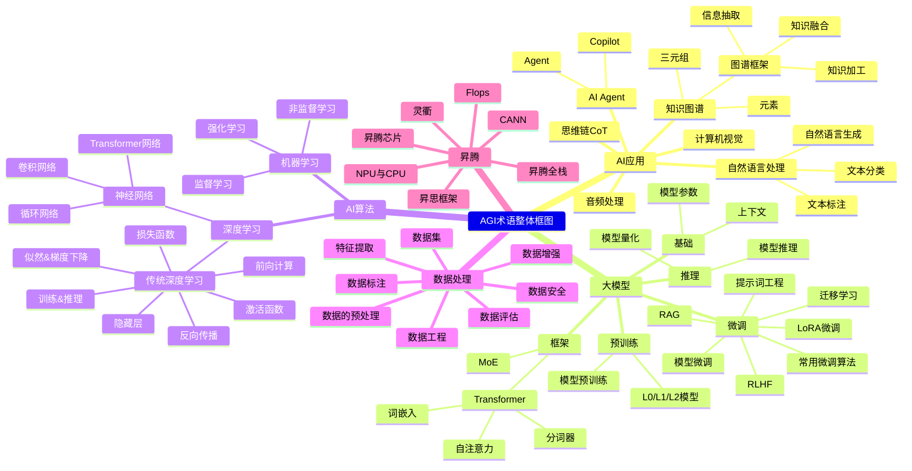
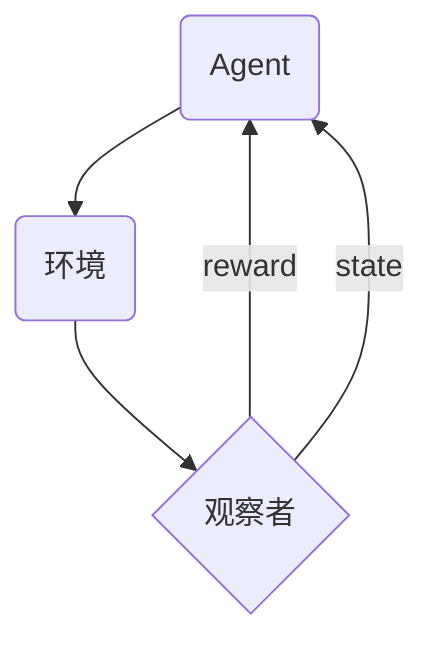

> 以笔记简评的形式介绍AGI/AI训练领域内一些基础理论与常用术语及其概念

# **总体框图**
> 由于github markdown渲染器的问题暂时先用代码块

# AI算法基础
### **监督学习（Supervised learning）**
监督学习是一种机器学习任务，其中算法通过从==标记的训练数据==中学习模式和关系，以进行预测或分类。
在监督学习中，算法的目标是通过输入特征与其相应的标签之间的关联性，构建一个能够准确预测新数据标签的模型。
- **监督学习的典型任务包括分类和回归问题**
1.分类问题：给定一组输入特征，目标是将其分为预定义的类别。例如，根据邮件的特征（主题、正文等）将其分类为“垃圾邮件”或“非垃圾邮件”。
2.回归问题：给定一组输入特征，目标是预测连续值的输出。例如，根据房屋的特征（面积、卧室数量等)预测其价格。
在监督学习中，关键是有标记的训练数据，这些数据包含输入特征和对应的标签或输出。通过使用这些标记的数据来训练模型，监督学习算法可以学习输入特征和输出之间的关系，并能够用于预测新的未标记数据的输出。
- **监督学习的流程监督 学习的基本流程要点如下**
1. 准备数据集：监督学习的前提是收集并整理好的数据集。数据集应确保完整性、准确性和可操作性。
2. 特征工程：特征是从数据中提取的用于训练模型的特定可测量属性。特征工程就是从原始数据中提取有用特征和构造新的特征，以便让模型更好地拟合数据。
3. 模型选择和训练：选择适合问题的模型来对样本进行拟合，并使用训练数据对模型进行训练。
4. 模型评估：使用测试数据集评估模型的性能。通常情况下需要将数据集分成训练集和测试集两部分，避免模型过度拟合。
5. 模型优化：根据模型评估结果对模型进行调整，以使其能够更好地适应数据并产生更好的预测结果。优化模型可以通过调整模型的超参数、添加新的特征等方法进行。
- **监督学习的算法可以分为以下几类**

| cata| content |
| --- | ---|
|线性模型：|线性回归、逻辑回归等|
|基于核函数的模型：|支持向量机（SVM）|
|决策树和基于集成的方法：|随机森林、Adaboost 等|
|人工神经网络和深度学习：|全连接神经网络、卷积神经网络（ CNN）、循环神经网络（RNN）及其变种模型|

### **非监督学习（Unsupervised learning）**
非监督学习是指在没有类别信息情况下，通过对所研究对象的大量样本的数据分析实现对样本分类的一种数据处理方法。由于在很多实际应用中，缺少所研究对象类别形成过程的知识，或者为了判断各个样本(模式)所属的类别需要很大的工作量，因此往往只能用无类别标答的样本集进形学习。

通过无监督式学习，把样本集划分为若干个子集(类别)，从而直接解决看样本的分类问题，或者把它作为训练样本集，再用监督学习方法进行分类器设计。 非监督学习目标不是告诉计算机怎么做，而是让计算机自己学习怎么做事情。 

**非监督学习一般有两种思路：**
1. 第一种思路称为聚类(Clustering)，这类学习类型的目标不是让效用函数最大化，而是找到训练数据中的近似点。常见的应用场景包括关联规则的学习及聚类等。常见算法包括Apriori、K-Means、EM等。

2. 第二种思路是在指导Agent时不为其指定明确的分类，而是在成功时采用某种形式的激励制度。需要注意的是，这类训练通常会被置于决策问题的框架里，因为它的目标不是产生一个分类系统，而是做出最大回报的决定，这类学习往往被称为强化学习。

------------

### **强化学习**
强化学习是基于环境的反馈而行动，通过不断的与环境的交互、试错，最终完成特定的目的，或者使得整体行动收益最大化，强化学习不需要训练数据的Label，但是它需要每一步行动环境给予的反馈，是奖励还是惩罚，反馈可以量化，给予反馈不断的调整训练对象的行为。
> 强化学习这个概念是2017年Alpha Go战胜了当时世界排名第一的柯洁而被大众知道，后面随着强化学习在各大游戏比如王者荣耀中被应用，而被越来越多人熟知。

**基本原理：**
强化学习是从动物学习、参数扰动自适应控制等理论发展而来，其基本原理是：如果Agent的某个行为策略导致的奖赏(强化信号)，那么Agent以后产生这个行为策略的趋势便会加强。Agent的目标是在每个离散状态发现最优策略以使期望的折扣奖赏和最大。

------------

### **深度学习**
深度学习是机器学习中的一种基于人工神经网络的机器学习方法，其关键在于通过多层神经网络对输入数据进行逐深度学习。
- 神经网络：其名称和结构均受到人脑的启发，目的是模拟大脑的某些机理与机制，来处理任务，由神经元和层组成。
- 神经元：每个神经元接收一组输入和一个偏置值，当信号（值）到达时会乘以一个权值。
- 层：神经网络由相互连接的节点组成，一般包括包括输入层、隐藏层和输出层。
- 标准网络：是最基本的神经网络类型，包括感知器和前馈网络。感知器是所有神经网络的基础，并且是更复杂的神经网络的基本构建模块。它只连接一个输入神经元和一个输出神经元。前馈网络是由多个感知器组成的集合，其中包含三种基本类型的层：输入层、隐藏层和输出层。在前馈网络中，来自上一层的信号会被乘以权重并增加偏置，然后通过激活函数，传递到下一层。前馈网络使用反向传播来迭代更新参数，直到达到理想的性能为止。

------------

### **隐藏层**
在多级神经网络中，除输入层和输出层以外的其他各层叫做隐藏层。隐藏层其实是对==输入特征多层次的抽象==，最终的目的就是为了更好的线性划分不同类型的数据。
> 隐藏层通过非线性变换将输入数据进行特征转换，从而使得神经网络能够更好地学习和预测复杂的模式。 根据不同的任务和数据特征，可以设置不同数量和类型的隐藏层。 一般来说，隐藏层及其神经元的数量越多，神经网络的表达能力越强，但同时也会增加神经网络的计算复杂度和训练难度。

------------

### **激活函数**
激活函数（Activation functions）对于人工神经网络模型去学习、理解非常复杂和非线性的函数来说具有十分重要的作用。它们将==非线性特性==引入到我们的网络中。如图，在神经元中，输入的 inputs 通过加权，求和后，还被作用了一个函数，这个函数就是激活函数，引入激活函数是为了增加神经网络模型的非线性。

我们知道神经网络模拟了人类神经元的工作机理，激活函数（Activation Function）是一种添加到人工神经网络中的函数，旨在帮助网络学习数据中的复杂模式。在神经元中，输入的input经过一系列加权求和后作用于另一个函数，这个函数就是这里的激活函数。
> 类似于人类大脑中基于神经元的模型，激活函数最终决定了是否传递信号以及要发射给下一个神经元的内容。在人工神经网络中，一个节点的激活函数定义了该节点在给定的输入或输入集合下的输出。标准的计算机芯片电路可以看作是根据输入得到`1`或`0`输出的数字电路激活函数。

------------

### **损失函数（Loss function）**
== 损失函数 ==用来评价模型的==预测值==和==真实值==之间的差距，损失函数给出的差距越小，通常模型的性能越好。常用的损失函数有softmax或SVM。

举个栗子：以图片分类问题为例，通过线性分类器计算出的各个图片对应分类的置信度，我们需要人为的寻找该图片在哪一个分类上得分最高，并不断的变换权重参数来最终确定哪个权重是预测准度最高的值。这是一件非常麻烦的事情，因此引入一个能够自动帮我们衡量寻找最优权重参数(W)的函数是必要的，这就是损失函数的由来了

------------

### **似然和梯度下降**
- 似然：选取模型在某个事实上计算出的概率作为似然
- 梯度下降：全部参数沿着损失函数（Loss）最小的方向，直至损失函数下降到很低的水平。

真实情况由于模型一次能看很多条数据。所以应该是所有事实同时发生的概率作为似然。数学上独立事件同时发生的概率可以视作全部概率的乘积。最优化过程就是这个乘积最大化。节省算力起见，可以让模型输出概率的对数，然后所有数据的情况加在一起取负号再最小化。与直接最大化是等价的。这个加和的结果叫做交叉熵损失函数。

真实的梯度下降是对一批数据同时执行的，这样可以保障避免单个数据上的规律与其他数据规律过于冲突，因此正确的全称是随机批梯度下降，所以越是复杂的数据，学习率越不能设置的太大，否则容易造成在新一批数据上损失无法下降，因此如何让损失稳定下降，是个炼丹级别的经验性艺术，需要对数据和模型都有非常深刻的理解。
