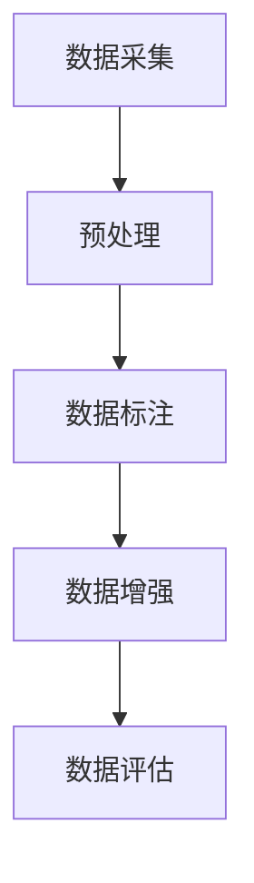
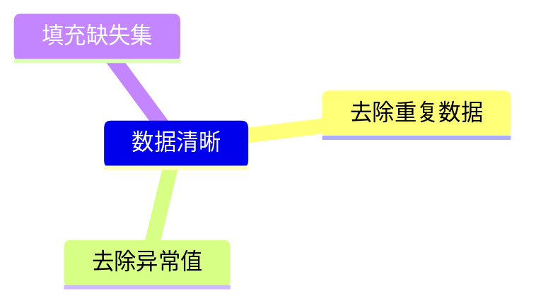
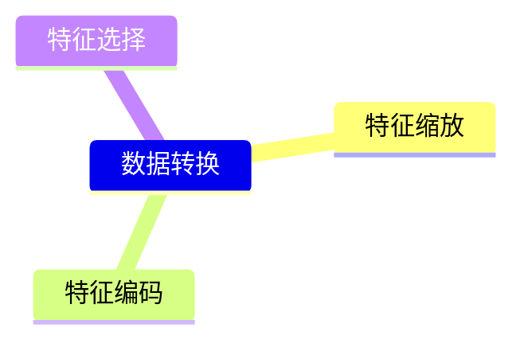
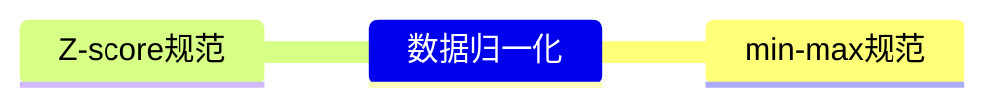

> 接续前篇，在#1中我们讨论了AI算法中的常用概念，在#2中我们将讨论AGI领域的第二大内容：**数据处理**
>
> 更新截止8.4

# **通用流程与综述**

### 数据采集
指从多种渠道导入大模型训练或者验证所需的文本、图片、视频等数据
在机器学习中，采集的数据集通常被划分为训练集、验证集和测试集三个子集。训练集用于训练机器学习模型，验证集用于选择和调整模型的超参数和结构，测试集用于评估模型的性能和准确度。
### 预处理
对原始数据进行一系列的操作，以便深度学习算法能够从中提取有用的信息，进而进行模型的训练、验证和部署。例如：
- 数据提取：提取各种常用文档中的关键数据，例如PDF、WORD、电子书、CSV、JSON等
- 数据清洗：删除掉不需要的内容，例如特殊符号过滤、重复内容的过滤、广告数据过滤等等
- 数据转换：把部分内容按照一定的规则进行转换，例如文档拆分、简繁互转、日期转换等等
### 数据标注
数据标注是指给原始数据（如图像、视频、文本、音频）添加标签的过程，这些标签形成了数据属于哪一类对象的表示。比如：
- 多类型数据标注：文本数据标注如单轮/多轮问答、问答排序等；视频/图片标注内容标注。
- 多形式标注：比如单人标注、团队标注等不同模式标注。
### 数据增强
数据增强AI领域的关键数据治理活动，包括两类技术：
- 数据生成技术：借助仿真器或生成类算法，通过模拟生成特定场景的数据；
- 数据增广技术：对已有数据的增广，按不同数据类别有不同的增广方法，有些方法也可以迁移使用，如：图像数据增强、文本数据增强、时序数据增强、图数据增强
### 数据评估
数据质量是保证数据应用的基础，其评估标准主要包括完整性、一致性、准确性、唯一性、准确性及时性等：
- 文本数据评估：评估文本类数据是否符合模型训练的标准，包括预训练数据、SFT数据、强化学习数据等。
- 视频数据评估：包括视频的基础质量、内容信息、内容导向及对应的文本质量。
- 图片数据评估：包括图片的基础质量、内容信息、内容导向及对应的文本质量。

------------

# 数据集
数据集是指一组相关的数据样本，通常用于机器学习、数据挖掘、统计分析等领域，数据集可以是数字、文本、图像、音频或视频等形式的数据，用于训练和测试机器学习算法和模型。
在机器学习中，数据集通常被划分为训练集、验证集和测试集三个子集。训练集用于训练机器学习模型，验证集用于选择和调整模型的超参数和结构，测试集用于评估模型的性能和准确度。
- 训练集是用于训练机器学习模型的数据集，它通常是数据集中的大部分数据。在训练集上，机器学习模型通过学习数据样本的特征和规律来调整自己的参数和权重，以便更好地拟合数据。例如，如果我们想要训练一个分类模型，我们可以把训练集中的每个数据样本都标上正确的标签，然后通过训练集中的数据样本来调整模型的参数和权重，以便让模型在预测未知数据时能够正确地分类。
- 验证集用于调整模型的超参数和结构的数据集。超参数是指那些需要手动设置的参数，如学习率、正则化参数等。在训练模型时，我们需要调整超参数的值，以便让模型能够更好地拟合数据。验证集通常是从训练集中独立出来的一部分数据，但与测试集不同，它不用于最终评估模型的性能。在调整超参数时，我们可以使用验证集来评估不同超参数下模型的性能表现，从而找到最优的超参数组合。
- 测试集是用于测试机器学习模型性能和准确度的数据集。测试集通常是从数据集中独立出来的一部分数据，它不参与模型的训练和调整过程。在使用机器学习模型对新数据进行预测时，我们需要评估模型的性能和准确度，以便选择最优的模型。测试集的结果可以帮助我们评估模型的准确度、泛化能力等指标，从而帮助我们选择最佳的模型。在评估模型性能时，我们可以使用一些指标，例如准确率、召回率、F1分数等，来评估模型的性能。

------------
# 数据预处理
数据预处理是指对原始数据进行一系列的操作，以便深度学习算法能够从中提取有用的信息，进而进行模型的训练、验证和部署。关键技术有：
1. 数据清洗：数据清洗是数据预处理的第一步。它是指去除数据集中的噪声、重复和缺失值等不必要的数据，以保证数据的质量和准确性。
2. 数据转换：将原始数据转换为更适合于机器学习算法的形式。
3. 归一化：数据归一化是将数据缩放到特定的范围内，以便它们可以被机器学习算法处理。
4. 数据集划分：数据集划分是将原始数据集划分为训练集、验证集和测试集的过程。这是为了评估机器学习模型的性能和准确性。
数据集划分是将原始数据集划分为训练集、验证集和测试集的过程。这是为了评估机器学习模型的性能和准确性。

- 去除异常值：异常值是指数据集中与其他数据明显不同的值。
- 填充缺失值：在数据集中，有时会出现缺失值。这些缺失值可能是由于测量错误、数据录入错误或其他原因引起的。

- 特征缩放：将特征值按比例缩小或放大，以便具有相同的数量级。
- 特征编码：特征编码是将分类特征转换为数值特征的过程。这可以使分类特征可以被机器学习算法处理。
- 特征选择：特征选择是从所有可用特征中选择最相关的特征。这可以减少特征数量，提高模型的性能。

- 最小-最大规范化：最小-最大规范化是将数据缩放到0到1之间的范围内。这可以保持数据的相对大小关系。
- Z-score规范化：Z-score规范化是将数据缩放到均值为0、标准差为1的范围内。这可以使数据分布更加正态化。

- 随机抽样：随机抽样是从原始数据集中随机选择一部分数据作为训练集、验证集和测试集。
- 分层抽样：分层抽样是在原始数据集中选择一定比例的数据，并根据其特征进行分层，以确保训练集、验证集和测试集中的数据具有相似的特征分布。

------------
# 数据标注
数据标注是指给原始数据（如图像、视频、文本、音频）添加标签的过程，这些标签形成了数据属于哪一类对象的表示。当训练数据被标注时，相应的标签被称为Ground Truth。
标注的本质：`标注= 常识 + 标注规则`
- 常识对应先验知识。有了常识能力，仅提供类别名称（未提供标注规则）就能标注。
- 标注规则帮助标注员明确任务、区分边界。包括：任务定义、类别定义、边界处理逻辑等。
1. 按标注对象划分

|方式|描述|
|---|---|
|图像标注|点线框标注、目标分类、目标跟踪、语义分割|
|音频标注|语音内容、语调情感、发音起始|
|文本标注|词性标注、语气标注、意图识别、实体标注|

2. 标注方式划分

|方式|描述|
|---|---|
|人工标注|标注员按照一定规则手工标注信息|
|机器标注|专用算法自动标注|

# 特征提取
特征提取是指从原始数据中提取出具有代表性的特征，用于数据分析、建模和预测等任务。
特征提取作为机器学习中一个前处理步骤，降维、去除不相关和冗余的数据，能够增加机器学习效率和效果，是大规模机器学习中必不可少的流程。
特征提取的目的是将原始数据转换为更具代表性和可解释性的特征，以便更好地描述和区分数据。例如，在图像识别任务中，可以使用特征提取方法从图像中提取出边缘、角点、纹理等特征，以便更好地区分不同的图像。在自然语言处理任务中，可以使用特征提取方法从文本中提取出词频、TF-IDF等特征，以便更好地描述和区分文本。
特征提取通常包括以下几个步骤：
1. 数据预处理：包括数据清洗、去噪、归一化等操作，以减少噪声和提高数据质量；
2. 特征选择：从原始数据中选择具有代表性和相关性的特征，以减少冗余和噪声；
3. 特征提取：使用各种方法从原始数据中提取具有代表性的特征，例如主成分分析、小波变换、局部二值模式等；
4. 特征降维：对提取出的特征进行降维处理，以减少冗余和噪声，并提高模型的训练速度和准确度。需要注意的是不同的任务和数据类型需要选择不同的特征提取方法和算法，需要根据具体情况进行评估和选择。

------------
# 数据增强
数据增强是一种通过人为地创建现有数据的变体来增加数据的大小和多样性的技术，通常可以提高模型性能，包括两类技术：
1. 从无到有的生成技术，需要借助仿真器或生成类算法，通过模拟生成特定场景的数据；
2. 对已有数据的增广，这是AI开发中最常用的，不同数据类别有不同的增广方法，有些方法也可以迁移使用，下表列举了常用的数据增广方法：

|图像数据增强|文本数据增强|时序数据增强|图表数据增强|
| :------------ | :------------ | :------------ | :------------ |
|几何变换（Geometric Transformations）|同义词词典（Thesaurus）|时域增强：下采样、扭转、翻转、扰动、注入噪声|随机映射
|颜色变换（Color Space）|随机插入（Randomly Insert）|频域增强：傅里叶变换(AAFT/IAAFT)、振幅和相位扰动|节点相似度映射|
|旋转/反射变换（Rotation/Reflection）|随机交换（Randomly Swap）|时-频域增强：短傅里叶变换(STFT)，规格增强|模体随机映射|
|噪声注入（Noise Injection）|随机删除（Randomly Delete）|基于分解的增强|模体的相似度映射|
|内核过滤器（Kernel Filters）|语法树结构替换|统计生成模型：LGT/MAR| |
|混合图像（Mix）|加噪（NoiseMix）|基于特征学习的方法：嵌入特征空间、深度生成模型、自动数据增强| |
|随机擦除（Random Erasing）|情境增强（Contextual Augmentation）| | |
|缩放变换（Scale）|生成对抗网络（GAN）| | |
|移动（Translation）|回译技术（Back Translation）| | |
|翻转变换（Flipping）|扩句-缩句-句法| | |
|裁剪（Cropping）|无监督数据扩增（Unsupervised Data Augmentation）| | |
|特征空间增强（Feature Space Augmentation）| | | |
|条件对抗神经网络（Conditional GANs）| | | |

# 数据评估
数据质量是数据治理流程中最关键的活动之一，高质量的数据对业务问题的解决，或算法目标的达成起到了至关重要的作用。在生产环境中，对于时效性要求不高的场景，通常采用定期质量评估的方法，来观测和处置数据质量问题，而在时效性要求较高的场景下，通常采用数据质量监控的手段，实时监控数据质量的变化情况，及时发现问题并处置。
由于数据对于AI模型的最终性能有重要影响，保证数据质量是保证AI模型性能的关键因素，质量评估分四个阶段：
1. 规划阶段
    - 理解业务和数据，识别关键业务对象或属性。
    - 基于业务问题目标和算法目标定义数据质量目标。
    - 设计质量控制流程和可行性。
2. 设计开发阶段
    - 从场景和数据角度分析质量度量指标。
    - 数据有效性中还要关注数据的丰富性，包括静态场景、动态场景、数据内容和特征分布四个方面。
    - 按照质量六性来审视度量指标的完备性。
3. 生产阶段
    - 定期对批量的数据进行质量评估，并获得评估报告。
    - 在数据质量实时监控中，设置质量事件告警门限和处置措施。
4. 维护阶段
    - 制定并实施数据清洗。
    - 对数据漂移问题告警和处置。
    - 改进数据标准和元数据。
    - 改进质量度量规则 

业界常用的数据质量分析工具有Informatica，InfoSphrer QualityStage，云化领域的工具有Google的DataQuality，华为云的Dayu数据质量评估系统等
