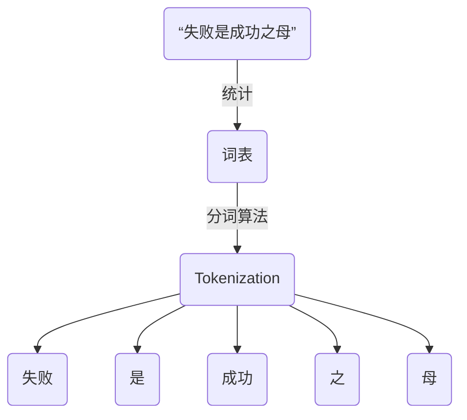
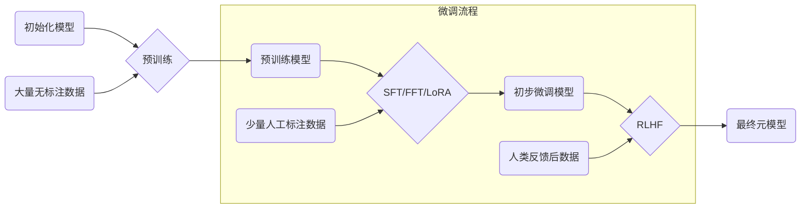

> 接续前篇，在#1与#2中我们讨论了AI算法与数据处理，接下来我们将讨论AGI领域最重要的内容：**大模型**
>
> 更新截止8.8

# 模型参数
模型参数就是指构成AI模型的各种数值型参数。这些参数就像是神经网络的“记忆细胞”，可以帮助AI模型学习和记忆大量数据中的模式和规律。
对于大型语言模型而言，参数量的大小直接影响了模型的性能和效率。一般来说，参数量越大，模型的表达能力越强，但同时也会导致模型训练时间和计算资源的消耗增加。因此，对于大型语言模型而言，参数量的大小需要在表达能力和计算效率之间进行权衡。

**如何通过模型参数计算模型大小？** 

GLM-130B这个大模型参数量在1300亿，假设每个参数都是一个 fp32，即 4 个字节，总字节就是 5200 亿字节，则 5200亿字节/1024/1024/1024 = 480GB，这是原始的理论值。
因为实际存储 wieght 权重参数会存 fp16，所以模型大小继续减半为 240GB，但是部分layer norm等数据会保留源格式fp32，因此实际会稍微有所增加到242GB左右。

------------
# 上下文
所有可能的上下文形成的集合，就完全代表了这个字本身

这里的集合近似于语言学上的所指(signified)的概念，也就是大家常说的语义(Semantic)。

这里的字接近于语言学上的能指(signifier)的概念，也就是大家常说的字形

------------
# 自注意力
Self-Attention机制的核心思想是让模型在处理序列数据时，能够同时考虑序列中的所有位置，而不仅仅是相邻的元素。这种机制允许模型捕捉序列内部的长距离依赖关系，这对于理解语言的复杂结构是非常有帮助的。

自注意力计算中，每个词，通过线性变化，得到三个部分： Query vector（查询向量）、 Key vector（键向量）和Value vector（值向量）。然后通过一个相似度函数（如点积）计算Q、K之间的相似度。归一化后，再与V进行加权求和，得到最终的表示
> 如一句话`The animal didn't cross the street because it was too tired`
这个“it”在这个句子是指什么呢？它指的是street还是这个animal呢？这对于人类来说是一个简单的问题，但是对于算法则不是。
当模型处理这个单词“it”的时候，自注意力机制会允许“it”与“animal”建立联系

1. 在Self-Attention中，每个输入序列的元素都会计算一个查询（Query）、键（Key）和值（Value）
2. 每个元素的查询会与所有元素的键进行比较，以确定它们之间的相似度或相关性，这个过程通常通过点积（dot product）来实现
3. 根据这个相似度得分，将这些相似度归一化得到注意力权重，再用这些权重对值向量进行加权求和，得到最终的表示

------------
# 分词器Tokenizer
自然语言是连续的字符序列，而大模型通常是以离散的tokens作为输入和输出单元。分词器将原始的文本字符串切分成一个个独立的tokens，以便输入到模型中进行处理。
- 英文中，它可以是单词（如“apple”）、词根（如“agri”）、词缀（如“-ing”）或者标点符号（如“!”或“?”）。
- 中文中可以是单个字，也可以是一个词（如 失败 成功）

------------
# 词嵌入Embedding
词嵌入的作用是将输入数据，例如文本，映射到低维向量空间，通过隐式特征表示数据中包含的信息。每一个位置有一个独特的向量，叫位置向量(Positional Embedding) 。
词向量或词嵌入技术是将词表中的单词映射为实数向量的技术，并且对于语义相似的词，其对应的词向量也相近

------------
# MoE
混合专家模型（Mixture of Experts ，MoE ）是一种集成学习方法，它通过将多个专业化的子模型（即“专家”）组合起来，形成一个整体模型。每一个“专家”都在其擅长的领域内做出贡献，而决定哪个“专家”参与解答特定问题的，是一个称为“门控网络”的机制。每个专家模型可以专注于解决特定的子问题，而整体模型则能够在复杂的任务中获得更好的性能。
在结构上，MOE用稀疏的Switch FFN层替换了Transformer中存在的密集前馈网络（FFN）层，并增加了门控网络。

**MOE由两个关键组成部分构成：门控网络（GateNet）和专家网络（Experts）**。
- 门控网络：负责根据输入数据的特征，动态地决定哪个专家模型应该被激活以生成最佳预测。
- 专家网络：是一组独立的模型，每个模型都负责处理某个特定的子任务。
对一token而言，门控网路选择topk个专家网络进行加权求和，得到输出。

**负载平衡策略：**
门控网络倾向于为相同的少数专家产生大的权重，从而导致一部分专家网络一直被选择，而另一部分始终不被选择。为了缓解负载不均衡现象，提出负载均衡损失函数
> 出自论文《OUTRAGEOUSLY LARGE NEURAL NETWORKS: THE SPARSELY-GATED MIXTURE-OF-EXPERTS LAYER》

------------
# L0&L1&L2模型
- 预训练L0：训练的基础模型，具备共性属性的规律的元模型
- 领域增量训练L1：按模型的细分功能进行专门训练的任务模型
- 场景微调模型L2：基于基础和领域模型的微调，得到符合应用场景的专一模型

模型的称呼实际上来自于 大型语言模型（LLM）， 但由于领域不同，各个领域所谓的“大”并不一致，所以学术界一般将L0模型称 为基础模型（Foundation Model）或预训练模型 （Pretrained Model）

------------
# 模型构建流程-预训练
- 预训练数据：从网页、书籍、代码、维基百科等多种来源搜索，过滤低质量和有害数据，获得预训练文本数据。
- 预训练：从大量的无标注数据中以自监督的方式学习语言的潜在模式和规律（文本的上下文信息，单词间的语义关系）

1. Pre-training (预训练)：学习基础的文本上下文信息、单词语义关系，获得基础模型
2. SFT (指令微调)：具备对话交互和指令遵从能力，激发模型特定任务的能力
3. RLHF (人类反馈的强化学习)：输出与人类语言习惯、喜好相近的答案以对齐人类偏好

------------
# 模型微调

模型微调（fine-tuning）是一种迁移学习方法，在不修改网络结构、直接对其最后几层的参数进行微调的同时，保留原网络前面的层参数不变，达到提升模型性能的目的。因此，模型微调非常适用于现有任务的相关领域、数据集相似等条件下，可以显著提高模型的精度和效果。
**核心思想：**有监督训练，利用这些有监督数据，使用与预训练阶段相同的语言模型训练算法，在基础语言模型基础上再进行训练，从而得到有监督微调模型（SFT 模型）。经过训练的SFT 模型具备了初步的指令理解能力
和上下文理解能力。
数据形式：较少量的<问题, 回复>指令数据

------------
# 迁移学习
迁移学习（Transfer Learning）通俗来讲就是学会举一反三的能力，通过运用已有的知识来学习新的知识，其核心是找到已有知识和新知识之间的相似性，通过这种相似性的迁移达到迁移学习的目的。世间万事万物皆有共性，如何合理地找寻它们之间的相似性，进而利用这个桥梁来帮助学习新知识，是迁移学习的核心问题。

------------
# 微调方法
1. 全量微调
    - 概念：对整个预训练模型的所有参数进行微调，以适应特定任务
    - 优点：能够最大程度地提升模型在特定任务上的表现
	- 缺点：计算和存储成本高，微调过程复杂且耗时，难以支持频繁更新
2. PEFT
    - 概念：Parameter-Efficient Fine-Tuning，通过只调整模型的一部分参数来实现微调，从而减少计算资源需求
    - 优点：计算和存储成本低，微调速度快，适用于低资源环境
	- 缺点：可能无法达到全量微调的性能提升幅度

------------
# LoRA微调
LORA: LOW-RANK ADAPTATION OF LARGE LANGUAGE MODELS，一种轻量级的微调方法。在模型的特定层中加入旁路，微调时仅旁路的参数会被更新。旁路中的参数量比原始模型的参数量小得多
LoRA 允许我们通过优化适应过程中密集层变化的秩分解矩阵，来间接训练神经网络中的一些密集层，同时保持预先训练的权重不变。
在原始 PLM (Pre-trained Language Model) 旁边增加一个旁路，做一个降维再升维的操作，来模拟所谓的intrinsic rank。
训练的时候固定 PLM 的参数，只训练降维矩阵 A 与升维矩阵 B 。而模型的输入输出维度不变，输出时将 BA 与 PLM 的参数叠加。
用随机高斯分布初始化 A ，用 0 矩阵初始化 B ，保证训练的开始此旁路矩阵依然是 0 矩阵。

------------
# 提示词工程
在大语言模型中，Prompt是指用于引导模型生成准确文本的输入文本。
Prompt可以是一个词，一个主题，一段描述等等，它可以帮助模型理解用户的意图并生成相应的文本。
在使用LLM进行文本生成时，Prompt的选择和设计非常重要，因为它将直接影响生成文本的质量和准确性。
1. 大模型生成文本的过程可视为一个黑盒，同一个模型下对于同一个场景，使用不同的Prompt也会获得不同的结果。
2. Prompt工程是指在不更新模型参数的前提下，通过设计和优化Prompt的方式，引导大模型生成我们目标结果的方法。
3. 有效的Prompt设计（也被称为Prompt工程）对于使用大模型实现预期结果至关重要，包括选择正确的单词、短语、符号和格式，以指导模型生成高质量的相关文本。

------------
# RAG
检索增强生成（ Retrieval-Augmented Generation ）：在不更改模型参数的基础上，为大模型接入外部知识库,通过“知识外挂”的手段来提升大模型应用的准确性，以此弥补大模型自身存在的幻觉、时效性差、缺乏专业领域知识等缺陷。
**LLM大语言模型典型问题：**
1. 依赖的信息可能过时
2. 处理特定知识时效率不高
3. 推理依赖专有数据训练
4. 受限于部门数据密集和权限隔离要求，相关数据不能训练到模型中（模型本身不具备知识分域能力）

**RAG解决方案（不做模型增强训练）** 通过索引、检索、生成等标准能力：
1. 提高了知识更新的速度
2. 增强了内容可追溯性
3. 避免了专有数据泄露
4. 在模型基础上增加了数据分权分域能力

------------
# RLHF
RLHF ：Reinforcement Learning from Human Feedback的缩写，即基于人类反馈的强化学习。这是一种通过将人类培训师的智慧和经验融入到模型训练过程中来创建更强大的学习过程的方法。RLHF使用人类反馈来创建奖励信号，然后使用该信号通过强化学习来改进模型的行为。

**核心思想：** SFT阶段教会模型什么是正确的回答，偏好对齐阶段告诉模型什么人类更偏好的回答
- 数据形式：<问题, 多个回答>数据，多个回答可以是answer1>answer2>answer3的排序方式，或者（reject_answer, chosen_answer）组合方式
- 方法：有监督训练

------------
# 二次训练、微调、SFT、LORA的区别
大模型微调：基于预训练大模型，使用相对少的人工标注数据和算力，针对具体的场景需要继续训练大模型；
- 按训练阶段和目标区分，微调可以分为监督微调（SFT）和基于人类反馈强化学习微调（RLHF）；
- SFT又可分为全参微调（FFT）和低参微调（PEFT高效参数微调，代表技术为LoRA），其中LoRA等低参微调只更新大模型的部分参数，因此所需的计算和内存资源比全参微调大幅降低。

|术语|解释|
|---|---|
|SFT（Supervised Fine-Tuning）|有监督微调|
|FFT（Full Fine-Tuning）|全参微调|
|PEFT（Parameter-Efficient Fine-Tuning）|高效参数微调，只微调模型中一小部分额外的参数|
|LoRA（Low-Rank Adaptation of LLM）|低秩矩阵微调|
|RLHF（Reinforcement Learning from Human Feedback）|基于人类反馈的强化学习|

**微调类型分阶段对比：**

|阶段|预训练|SFT：FFT|SFT:LoRA|RLHF|
|---|---|---|---|---
|通俗类比|课本学习|做习题|做错题|名师1对1|
|数据集|原始数据，低质量、大规模通识知识（TB级数据）|高质量问答对，覆盖行业基础知识，数据适中（GB级数据）|高质量问答对，覆盖场景知识，数据量少（MB级数据）|提示词和高质量数据反馈，数量较少（几千~几万字节数据）|
|算法|语言模型|语言模型|语言模型|强化学习|
|场景|基础模型，通用能力|增强行业知识|增强场景化知识|AI治理，黄暴伦理等|
|资源|上万张训练卡|上百张训练卡|数十张训练卡|数百张训练卡|
|时间|数月|数周|数天|数周|

# 模型推理
模型推理建立在训练完成的基础上，将训练好的模型应用于新的、未见过的数据。模型利用先前学到的规律进行预测、分类或生成新内容
大模型推理包括 Prefill  和 Decode 两个阶段
- Prefill（全量、Summarization、Prompt）阶段：处理所有的输入生成第一个token的过程，Prefill 阶段在一个推理任务只执行一次，与输入/输出序列长度无关
- Decode（增量、Generation、Token Generation）阶段：通过自回归的方式逐个生成完整答案所有token的过程，Decode 阶段在一个推理任务执行多次，由输出序列长度决定

------------
# 模型量化
模型量化主要意义就是加快模型侧的速度，包括减小模型大小减少存储空间、减少内存占用、减少设备功耗、加快推理速度
### 常见量化数据类型
- 低精度模型表示模型权重数值格式为 FP16（半精度浮点）或者 INT8（8位的定点整数），但是目前低精度往往就指代 INT8。
- 常规精度模型则一般表示模型权重数值格式为 FP32（32位浮点，单精度）。
- 混合精度（Mixed precision）则在模型中同时使用 FP32 和 FP16 的权重数值格式。 FP16 减少了一半的内存大小，但有些参数或操作符必须采用 FP32 格式才能保持准确度。
### 量化优势
- 减小模型大小：如 int8 量化可减少 75% 的模型大小，int8量化模型大小一般为 32 位浮点模型大小的 1/4：
- 减少存储空间：在端侧存储空间不足时更具备意义。
- 减少内存占用：更小的模型当然就意味着不需要更多的内存空间。
- 减少设备功耗：内存耗用少了推理速度快了自然减少了设备功耗。
- 加快推理速度：访问一次 32 位浮点型可以访问四次 int8 整型，整型运算比- 浮点型运算更快；CPU 用 int8 计算的速度更快，某些硬件加速器如 DSP/NPU 只支持 int8。比如有些微处理器属于 8 位的，低功耗运行浮点运算速度慢，需要进行 8bit 量化。
### 模型量化的方案
1. data free：不使用校准集，传统的方法直接将浮点参数转化成量化数，使用上非常简单，但是一般会带来很大的精度损失，但是高通最新的论文 DFQ 不使用校准集也得到了很高的精度。
2. calibration：基于校准集方案，通过输入少量真实数据进行统计分析。很多芯片厂商都提供这样的功能，如 tensorRT、高通、海思、地平线、寒武纪
finetune：基于训练 finetune 的方案，将量化误差在训练时仿真建模，调整权重使其更适合量化。好处是能带来更大的精度提升，缺点是要修改模型训练代码，开发周期较长。
3. TensorFlow 框架按照量化阶段的不同，其模型量化功能分为以下两种：
4. Post-training quantization PTQ（训练后量化、离线量化）；
5. Quantization-aware training QAT（训练时量化，伪量化，在线量化）
